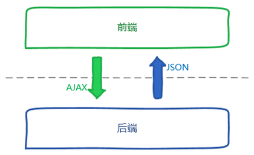

# 前后端分离

#### [返回目录](README.md)

## 1 适用场景

* 网站前端变化远比后端变化频繁。

* 该网站尚处于原始开发模式，数据逻辑与表现逻辑混杂不清。

* 网站前端团队和后端团队分属两个领导班子，技能点差异很大。

* 网站前端交互复杂/跨设备兼容要求高。

## 2 核心

* 前端：负责`View`和`Controller`层。
* 后端：负责`Model`层，业务处理/数据等。

> 注：需要有`node`服务器，前端才能负责`Controller`层。

## 3 前后端交互

RESTFUL服务

  

[RESTful API 设计指南 by 阮一峰](http://www.ruanyifeng.com/blog/2014/05/restful_api.html)

## 4 前后端分离开发模式对比

#### 传统开发模式

1. 拿到需求
1. UI产出设计图
1. 前端产出html静态页面
1. 后端将html静态页面套成后端模板页面
1. 集成出现问题
1. 前端返工
1. 后端返工
1. 二次集成
1. 集成成功
1. 交付

> 前后端强依赖，后端必须要等前端的html做好才能套模板页。如果需求变更导致设计变更，静态html需要做出变更，同时导致后端模板页面变更，开发效率低。

#### 前后端分离开发模式

1. 拿到需求
1. UI产出设计图
1. 前后端约定接口契约&数据&参数
1. 前后端并行开发
1. 前后端集成
1. 前端页面调整
1. 集成成功
1. 交付

> 前后端无强依赖，可并行开发，如果需求变更，只要接口&参数不变，就不用两边都修改代码，开发效率高。

## 5 更专注自身

后端工程师：

> 三高（高并发，高可用，高性能），安全，存储，业务等等。

前端工程师：

> html5，css3，es6，jquery，angularjs，reactjs，vuejs，webpack，less/sass，gulp，nodejs，Google V8引擎，JavaScript多线程，模块化，面向切面编程，设计模式，浏览器兼容性，性能优化等等。  
页面表现，速度流畅，兼容性，用户体验等等。

## 6 前端工程化

#### 6.1 解决的问题

1. 提高多人协作的效率
1. 保证项目的可维护性
1. 提高项目的开发质量

#### 6.2 工程化思路方法

##### 6.2.1 模块化

> 简单来说，模块化就是将一个大文件拆分成相互依赖的小文件，再进行统一的拼装和加载。只有这样，才有多人协作的可能。

##### 6.2.2 组件化

> __组件化`≠`模块化。__  
模块化只是在文件层面上，对代码或资源的拆分；而组件化是在设计层面上，对UI（用户界面）的拆分。  
从UI拆分下来的每个包含模板`HTML`+样式`CSS`+逻辑`JS`功能完备的结构单元，称之为`组件`。

##### 6.2.3 规范化

> 模块化和组件化确定了开发模型，而这些东西的实现就需要规范去落实。  
> * 项目结构的规范
> * 开发编码规范
> * 前后端接口规范
> * 技术文档规范
> * 组件管理
> * Git分支管理
> * Commit描述规范
> * 定期CodeReview
> * 视觉图标规范
> * ...  
> 此部分前端相关内容移步
[YQN前端开发规范手册](https://git.iyunquna.com/frontend/docs/standard/blob/master/README.md)

##### 6.2.4 自动化

> 任何简单机械的重复劳动都应该让机器去完成。

* 代码校验
* 自动化测试
* 自动化构建
* 自动化部署
* 持续集成

## 7 工程化下的前端做了什么

1. 语言和转译器
1. UI大型化
    * MVVM
    * 路由
    * 状态管理
1. 依赖管理和发布打包
1. 前端测试

#### 7.1 语言和转译器

JavaScript版本:  
`ES3` --> `ES5` --> `ES6`(又名`ES2015`) --> `ES7`(目前还是草案)

`开发效率` 和 `兼容性` 并存

通过 转译器`Bable` 来解决高版本语言带来的浏览器兼容问题。
> 在开发时用高版本语言编写代码，然后用转译器转换成低版本的代码，在生产环境上运行以兼容旧浏览器。

#### 7.2  UI大型化

* `React`，`Vue` 之类的MVVM框架本质是高效的前端模板View。
* 它们都有自身的生态圈。主要包括  
前端路由库：`React-Router`，`Vue-Router`；  
状态管理库：`Flux`，`Redux`，`Mobx`，`Vuex` 等；  
UI Toolkit库：`antDesign`，`element`，`material`，`iView` 等等等等。

#### 7.3 依赖管理和发布打包

直到ES6发布前JavaScript长期以来都是没有正式的模块化方案的。
通过 `webpack`，`Browserify` 等打包工具做到开发时合理引入不同规范的依赖包（`CMD`，`AMD`，`UMD`），输出时自动整合依赖顺序和作用域，转译，合并，按需切分代码，并打包压缩。

> 前端工程化的核心，通过配置webpack等工具可以实现  
> * 编译 jsx、es6、lcss、scss 等资源
> * 自动引入静态资源到相应 html 页面
> * 实时编译和刷新浏览器
> * 对文件使用 hash 命名，做强缓存
> * 按指定模块化规范自动包装模块
> * 图片，字体路径处理、压缩
> * 后编译css自动添加兼容浏览器前缀
> * 按需打包合并 js、css
> * 压缩 js、css、html
> * 前端本地服务器跨域代理对接接口
> * 语法，格式检查
> * ...   
> 大幅提高前端开发的效率和质量

#### 7.4 前端测试

需要在稳定的业务规则和完善的开发流程支撑下，自动化测试才有用武之地，这里暂不展开
### [返回目录](README.md)
